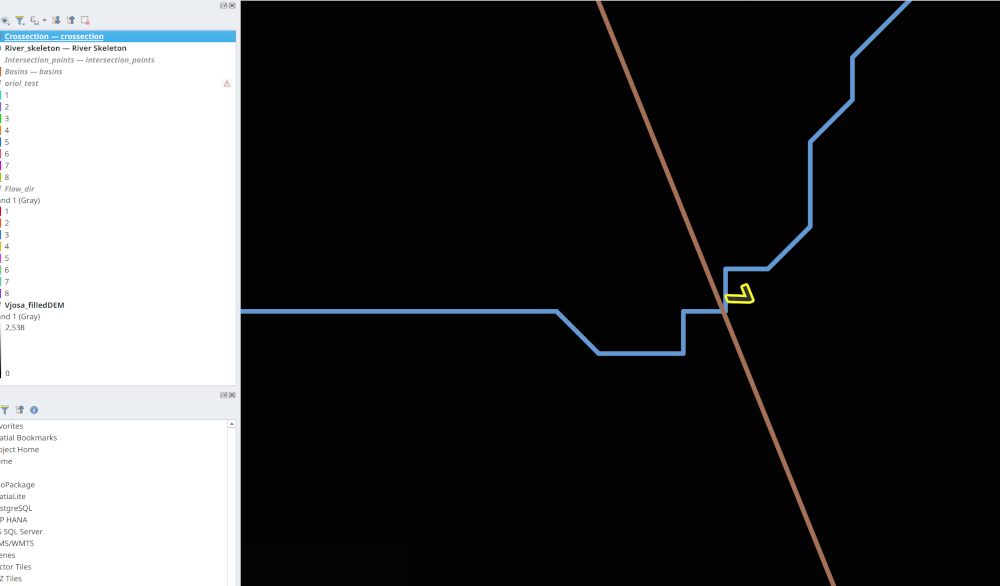
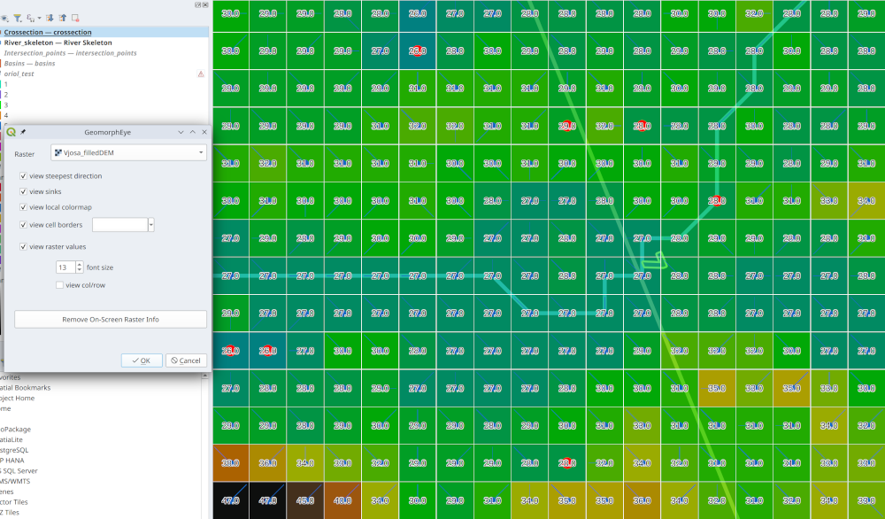

# G-ANT QGIS-plugins

## Feature Navigator

A QGIS plugin to navigate through the features of a vector layer.

After selecting a layer in the layer combo, the plugin will load the features in memory and by using next and previous, teh plugin centers the map on the feature and selects it.


The ```feature_navigation_dialog.py``` is created using:

```
pyuic5 -o feature_navigator_dialog.py feature-navigator_dialog_base.ui
```

## Raster loader from vector field

A QGIS plugin to load a rasters from the name contained in a vector field.

Rasters are loaded from the selected features of the selected layers, if the field name is available.


## Geomorphologic Eye

A QGIS plugin that gives a quick and simple view on a raster layer. 
It enables:

* a local colormap for better understanding the landscape
* visualization of steepest direction and sinks
* visualization of cell values and row/col in the original raster
* visualization of cell borders

For example, you can see this DEM:



like this:



